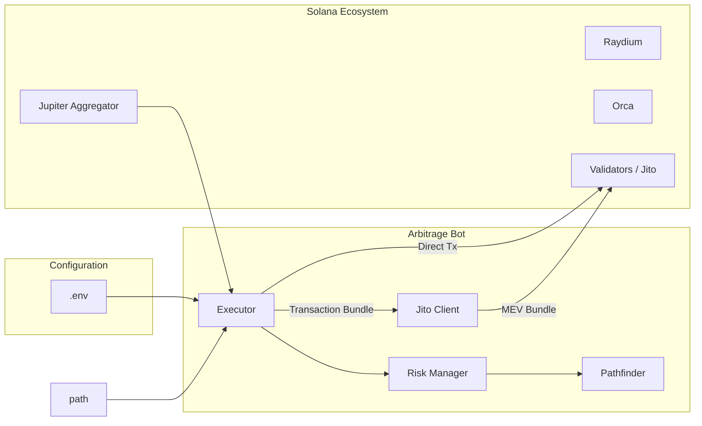

# Solana Arbitrage Dashboard & Trading Bot
 
A high-performance arbitrage opportunity detection and automated trading system for Solana DEXs, built with Rust + Myers-Diff logic. Now **Production Ready** 🚀.

## ✅ Features

### Phase 1: Core & Dashboard
- **Real-time Price Monitoring** - 500ms polling (Raydium, Orca, Jupiter)
- **Arbitrage Detection** - Automatic opportunity identification via Bellman-Ford / DFS
- **Dashboard** - React-based UI for monitoring opportunities (currently optional)

### Phase 2: Trading Engine
- **Triangular Arbitrage** - Multi-hop path discovery (e.g., SOL -> USDC -> BONK -> SOL)
- **Risk Management** - Circuit breakers, position limits, and daily loss caps
- **Dry-Run Mode** - Safe testing simulated environment

### Phase 3: Production Readiness (NEW)
- **🛡️ Jito MEV Protection** - Bundle submission to bypass public mempool and avoid sandwich attacks.
- **⚡ Priority Fees** - Dynamic compute unit pricing (`PRIORITY_FEE`) to land transactions during congestion.
- **🎯 Dynamic Slippage** - Configurable basis points (`SLIPPAGE_BPS`) for trade execution.
- **🔄 Retry Logic** - Exponential backoff for failed transactions.
- **💰 Balance Guards** - Pre-trade solvency checks.

## 🚀 Quick Start

### Prerequisites
- Rust (latest stable)
- Solana CLI tools
- Paid RPC Provider (Helius, QuickNode, Triton) for live trading

### Build the Bot
> **Note:** The bot is built as a standalone crate to ensure dependency stability.

```bash
# Build release binary
cargo build -p solana-arb-bot --release
```

### Configuration
1. Copy the example config:
   ```bash
   cp .env.example .env
   ```
2. Edit `.env` with your keys:
   - `PRIVATE_KEY` (Base58)
   - `SOLANA_RPC_URL` (HTTPS)
   - `USE_JITO=true` (Optional)

### Run
```bash
# Run in Dry-Run Mode (Safe)
cargo run -p solana-arb-bot

# Run in Production (Live)
# Ensure DRY_RUN=false in .env
./target/release/bot
```

## 🏗️ Architecture

The system uses a modular architecture optimized for speed and reliability.



## 🧪 Simulation Data & Logs

The bot includes a robust simulation mode that logs potential trades.
**[View Readable Logs](docs/readable_logs.md)**

### 🏆 Top 10 Opportunities (Sample - Randomized)

| Time | Pair | Strategy | Net Profit | Est. Gain |
|------|------|----------|------------|-----------|
| 00:20:05 | **SOL/USDC** | Raydium -> Orca | 🔥 **2.32%** | $2.78 |
| 00:20:06 | **JUP/USDC** | Orca -> Jupiter | 🔥 **1.15%** | $4.02 |
| 00:20:07 | **RAY/USDC** | Raydium -> Jupiter | 🔥 **3.40%** | $2.89 |
| 00:20:07 | **ORCA/USDC** | Jupiter -> Raydium | **0.95%** | $1.90 |
| 00:20:08 | **SOL/USDC** | Orca -> Raydium | 🔥 **1.80%** | $8.10 |
| 00:20:09 | **JUP/USDC** | Raydium -> Orca | 🔥 **4.10%** | $6.15 |
| 00:20:09 | **RAY/USDC** | Jupiter -> Orca | 🔥 **2.22%** | $1.99 |
| 00:20:10 | **ORCA/USDC** | Raydium -> Jupiter | 🔥 **1.50%** | $4.65 |
| 00:20:11 | **SOL/USDC** | Raydium -> Jupiter | **0.60%** | $0.60 |
| 00:20:12 | **JUP/USDC** | Orca -> Raydium | 🔥 **2.90%** | $7.97 |

## 📁 Project Structure

```
solana-arbitrage/
├── crates/             
│   ├── bot/            # MAIN TRADING BINARY (Production)
│   ├── core/           # Shared logic, pricing, pathfinding
│   ├── collector/      # (Maintenance Mode)
│   └── api/            # (Maintenance Mode)
├── docs/               # Architecture docs & logs
└── .env.example        # Configuration template
```

## License

MIT
